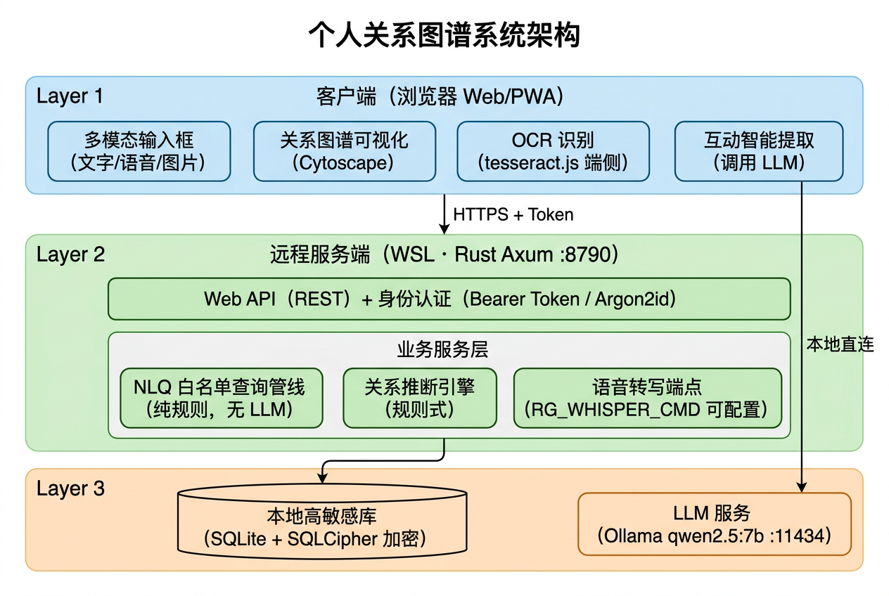

# 个人关系图谱 — 当前版本功能介绍

> 更新日期：2026-08-01（演示版）
> 架构版本：WSL 服务端 + Web 多端架构（2026-07 迁移完成）
> 本轮新增：首页多模态输入框（文字/语音/图片 OCR）、联系人"关系网络"焦点模式、学校/项目字段与推断规则增强、内置演示数据、NLQ 多意图扩展（新增/更新/互动/路径）、多主题切换

---

## 一、项目概述

**Relationship Graph（个人关系图谱）** 是一款面向个人的人脉管理应用，核心能力是：

- 用自然语言检索人脉（"上海做投资的朋友有哪些？"），支持文字、语音、图片截图三种输入方式
- 维护联系人档案与互动记录，AI 自动提取关键信息
- 以图谱形式可视化人际关系网络，一键查看任意联系人的关系网络
- 全程本地化、加密存储，保护高敏感隐私数据

### 系统架构图



系统的所有数据处理均在您自己的服务器环境中完成，不依赖任何外部云服务。具体来说：您通过浏览器或手机输入信息（支持文字、语音、图片三种方式），这些信息只会发送到您自己部署的服务器上进行处理。图片文字识别（OCR）甚至直接在您的浏览器中完成，**图片不会离开您的设备**。所有数据最终存储在您服务器上的加密数据库中（技术细节：SQLite + SQLCipher 库级加密）。系统使用的 AI 大模型（Ollama）同样运行在您自己的服务器上，仅用于从聊天记录中提取关键信息，不会将任何数据发送到外部网络。

### 当前架构

```
Windows 浏览器 / 手机（局域网） 
        │  HTTP + Bearer Token
        ▼
React Web 前端（Vite，端口 1420）
        │  REST API
        ▼
Rust Axum 服务端（WSL，端口 8790）
        │
        ▼
SQLite + SQLCipher 加密库（Argon2id 派生密钥）
```

| 层 | 技术栈 | 说明 |
|---|---|---|
| 前端 | React 18 + TypeScript + Vite + Tailwind CSS + Cytoscape.js | 支持 Windows 浏览器与手机经局域网访问 |
| 后端 | Rust Axum + rusqlite/SQLCipher | 运行于 WSL，端口 8790（`RG_PORT` 可覆盖） |
| 数据 | SQLite + SQLCipher 库级加密 | 数据目录 `~/.local/share/relationship-graph`（`RG_DATA_DIR` 可覆盖） |
| AI | Ollama 本地 LLM（qwen2.5:7b） | 互动文本信息提取；运行在用户自己的服务器上，数据不外传 |
| OCR | tesseract.js（端侧 WASM） | 中英文图片文字识别，模型文件本地托管于 `public/tesseract/` |

> 说明：`src-tauri/` 为早期 Tauri 桌面原型，业务逻辑已全部移植到 `server/`，目前保留但不再使用。

### 🔒 数据安全承诺

本系统在设计上将数据隐私放在首位，以下是核心安全保障：

1. **数据只存在您自己的服务器上** — 所有联系人信息、聊天记录、关系数据均存储在您自己部署的服务器中的加密数据库里，不会上传到任何外部平台
2. **AI 分析完全在本地完成** — 系统使用您自己服务器上运行的大模型（Ollama）进行智能分析，不依赖任何外部在线 AI 服务（如 ChatGPT、文心一言等），您的数据不会被第三方获取
3. **没有任何数据会发送到外部网络** — 系统运行在您的局域网环境中，与外部互联网完全隔离，即使断网也能正常使用全部功能
4. **多层加密保护** — 数据库整库加密，需要主密码才能解锁访问；日志系统自动脱敏，不记录任何敏感信息原文

### 启动方式

```bash
# 后端（WSL）
cd server && cargo run

# 前端
npm run dev        # Vite 开发服务器，监听 0.0.0.0:1420
```

---

## 二、已实现的功能

### 1. 认证与安全 ✅

- 首次使用设置主密码，初始化 SQLCipher 加密数据库
- 主密码解锁 / 锁定数据库，Token 会话（12 小时有效期，内存存储）
- Argon2id 密钥派生，数据库整库加密
- 结构化日志遵循脱敏原则：不记录密码、Token、姓名、电话、内容原文

### 2. 联系人管理（CRUD）✅

- 完整的联系人档案：姓名、别名、电话、邮箱、公司、职位、城市、**学校 🆕**、**参与项目 🆕**、背景、关系强度、资源标签、敏感级别、状态、下一步行动、备注
- 学校与参与项目字段在表单与详情页均支持录入/展示，并作为关系推断的新依据
- 名片式列表展示（PersonList / PersonCard）
- 按提及文本搜索候选联系人
- **敏感级别三级控制**：高敏感联系人默认以别名脱敏展示（SensitivityGuard）

### 3. 关系管理 ✅

- 人与人之间的关系链路录入：介绍认识、同事、朋友、合作、其他
- 关系强度与描述
- 按联系人查询其全部关系

### 4. 互动记录 + AI 提取 ✅

- 记录与联系人的沟通内容（时间、原文、摘要、话题、待办）
- **Ollama 本地 LLM 自动提取**：从沟通文本中识别提到的人物、话题、待办事项并生成摘要，Ollama 不可用时自动降级
- 本轮修复了模型名硬编码失配问题（`qwen2:7b` → `qwen2.5:7b`），AI 提取恢复真正生效
- EntityResolver：将文本中提到的人名关联到已有联系人（含置信度与确认状态）
- 按联系人查看互动历史

### 5. 关系图谱可视化 ✅

- Cytoscape.js 渲染人脉网络（节点=联系人，边=关系）
- 按敏感级别着色：高敏感红、中敏感橙、低敏感蓝
- 大图性能优化：120+ 节点自动切换 concentric 布局、隐藏边、纹理化渲染
- 悬停提示与点击导航
- **待确认推断关系以橙色虚线呈现 🆕**：点击可查看推断理由，并就地确认 / 否认

### 6. 自然语言查询（NLQ）✅

- 支持按地点、资源标签、话题、状态、关系强度、最近互动时间等维度组合检索
- **安全设计**：LLM 不生成 SQL，走 QueryIntent 白名单解析管线，杜绝注入风险
- 结果按关系强度、互动时间、匹配度重排
- 高敏感联系人在结果中自动脱敏
- 附带"建议下一步行动"

### 7. Excel/CSV 批量导入 ✅

四步导入向导（上传 → 字段映射 → 预览确认 → 导入报告）：

- 前端 SheetJS 解析表头与数据行
- 表头词典自动猜测字段映射，支持手动调整
- 数据清洗归一化：电话格式、关系强度/敏感级别/状态的中文值映射
- 服务端预检：有效性校验 + 重复检测（精确匹配 / 仅姓名匹配两种策略）
- 逐行容错批量写入，单批上限 5000 行
- 完整导入报告：成功、跳过、失败明细
- 已通过 1000 行测试数据的端到端验证（`test-data/联系人测试数据_1000.xlsx`）

### 8. 首页多模态输入框 ✅ 🆕

应用默认进入全新极简首页，居中大输入框支持三种输入方式：

- **文字**：直接键入问题，Enter 提交查询
- **语音（🎤）**：优先使用浏览器 Web Speech API 实时转写；浏览器不支持时自动降级为录音上传、由服务端 `POST /api/voice/transcribe` 转写；服务端未配置转写引擎时给出友好提示，不会静默失败
- **图片 OCR（📷）**：tesseract.js 端侧识别中英文，支持直接粘贴截图；识别出的文本填入输入框，用户确认后再发起查询

查询统一走既有 NLQ 白名单管线（不经过 LLM），高敏感联系人在结果中自动脱敏。旧版功能入口（联系人 / 图谱 / AI 查询(旧) / 导入）收纳为页面底部的灰色调试链接，不干扰主流程。

#### 查询结果点击跳转联系人详情 🆕

查询结果中的联系人卡片支持**点击直接跳转**到该联系人的详细信息页面，操作路径：

1. 在首页输入框输入查询（文字/语音/OCR）
2. 获得 NLQ 查询结果列表
3. 单击任意联系人卡片 → 自动切换到联系人 Tab 并展示该联系人的详情页

交互细节：
- 鼠标悬停时卡片高亮（浅蓝背景 + 蓝色边框），cursor 变为 pointer
- 点击时有 active 按压反馈
- 支持键盘无障碍操作：Tab 聚焦卡片后，按 Enter 或 Space 同样触发跳转

### 9. 联系人"关系网络"焦点模式 ✅ 🆕

- 联系人详情页新增紫色**"关系网络"按钮**，一键跳转图谱页
- 以该联系人为中心展示 **2 跳关系网络**（焦点模式），无关节点不渲染
- 图中同时显示**"我"虚拟中心节点**，以灰色点线连接焦点联系人，直观呈现"我 → 焦点人 → 其人脉"的路径
- 待确认的推断关系以橙色虚线区分，点击边可查看推断理由并确认 / 否认

### 10. 关系推断引擎 + 用户确认 ✅ 🆕

规则推断引擎（`server/src/infer.rs`）共五条规则，全部产出**可解释的推断理由**（如"同一公司：万科"）：

| 规则 | 置信度 | 关系类型 |
|---|---|---|
| 同一公司 | 0.8 | colleague |
| 同一介绍人介绍认识 | 0.6 | other |
| 同项目 🆕 | 0.6 | other |
| 同学校 🆕 | 0.5 | other |
| 同行业标签 + 同城 | 0.5 | other |

- 所有推断结果以 **pending** 状态入库，必须由用户逐条确认（confirmed）或否认（rejected）后才视为事实，被否认的不会重复生成
- 防护性限制：单次最多入库 200 条，分组超过 15 人不做两两组合，已存在关系跳过
- 五条规则均有单元测试覆盖

### 11. AI 查询功能现状

详见 [`docs/AI查询功能现状分析.md`](../AI查询功能现状分析.md)，要点：

- **NLQ 是纯规则白名单管线，不调用 LLM**——这是明确的安全决策：自然语言先解析为 QueryIntent，经白名单校验后路由到固定的参数化 SQL，模型永远不接触 SQL
- **全项目唯一的 AI 大模型调用点**是互动记录信息提取 — 该模型（Ollama qwen2.5:7b）完全运行在用户自己的服务器环境中，不连接任何外部在线 AI 服务；AI 只产出"建议"，最终数据入库仍需用户确认
- 关系推断同样是确定性规则引擎而非 AI 大模型：基于明确的结构化数据（如同公司、同学校）进行推断，可给出可解释理由与稳定置信度，不存在数据外泄风险
- 本轮已修复 Ollama 模型名失配（`qwen2:7b` → `qwen2.5:7b`），互动提取从长期降级恢复为真正生效

### 12. NLQ 多意图扩展 ✅ 🆕

**多功能自然语言输入**：首页输入框现支持 5 种操作意图，系统自动识别：

| 意图 | 示例 | 说明 |
|---|---|---|
| **查找联系人**（默认） | "谁在做地产"、"关系比较近的人" | 走既有 NLQ 白名单管线 |
| **新增联系人** | "刚认识了张明，做地产的，在上海" | 系统自动提取信息生成草稿，确认后保存 |
| **更新联系人** | "张明去了新公司XX科技" | 自动识别要修改的字段，确认后更新 |
| **添加互动记录** | "刚和李明聊了园区项目" | 自动提取互动信息，确认后记录 |
| **查找关系路径** | "我怎么认识张三的" | 展示人脉路径链 |

所有新增/更新/添加操作采用**"草稿确认"模式**——系统先展示预填表单，用户确认或修改后才实际保存，确保数据准确性。

按钮由文字"查询"改为**发送箭头图标**，更简洁直观。

### 13. 多主题切换 ✅ 🆕

**多主题切换**：页面右上角提供主题选择器，支持 3 种显示主题：

| 主题 | 说明 |
|---|---|
| ☀️ 浅色模式（默认） | 白色背景，适合日间使用 |
| 🌙 深色模式 | 深色背景，减轻视觉疲劳 |
| 🔲 高对比度模式 | 增强对比度，适合特殊场景 |

- 主题选择自动保存至 `localStorage`，下次打开时保持上次的设置
- 所有页面和组件统一适配，切换即时生效无闪烁
- 通过 CSS 变量系统实现，组件无需单独处理主题逻辑

### 14. 服务端 API 一览

| 分类 | 端点 |
|---|---|
| 公开 | `GET /api/health`、`GET /api/auth/state`、`POST /api/auth/setup`、`POST /api/auth/unlock` |
| 联系人 | `GET/POST /api/persons`、`GET/PUT/DELETE /api/persons/:id`、`GET /api/persons-search` |
| 关系 | `GET/POST /api/relationships`、`GET /api/persons/:id/relationships` |
| 关系推断 🆕 | `POST /api/relationships/infer`、`GET /api/relationships/pending`、`POST /api/relationships/:id/confirmation` |
| 互动 | `POST /api/interactions`、`GET /api/persons/:id/interactions`、`POST /api/entity-mentions` |
| 图谱/查询 | `GET /api/graph`、`POST /api/nlq` |
| 语音 🆕 | `POST /api/voice/transcribe` |
| 导入 | `POST /api/import/preview`、`POST /api/import/persons` |
| 会话 | `POST /api/auth/lock` |

---

## 三、演示路径与数据 🆕

### 内置演示数据

数据库已预置 6 位演示联系人：**张演示、李示例、陈样本、王样本、赵演示、孙示例**，含公司、城市、学校、项目、资源标签、关系与互动记录，覆盖下方全部演示场景。

演示数据由 `scripts/seed-demo-data.mjs` 生成，脚本**幂等**，可重复执行不会产生重复数据。

### 推荐演示动线

1. **解锁**：后端已重启（Token 仅内存存储，重启后旧会话失效），演示前先用主密码解锁一次
2. **首页多模态查询**：依次演示文字 / 语音 / 粘贴截图 OCR 三种输入，三个首页示例查询均有结果：

| 示例查询 | 结果数 |
|---|---|
| "谁在上海做地产，和我关系比较近？" | 3 条 |
| "上次聊过融资的人里，还没跟进的有谁？" | 2 条 |
| "这个懂车帝的投标，谁能帮上忙？" | 2 条 |

3. **关系网络**：打开任一演示联系人详情 → 点击紫色"关系网络"按钮 → 展示以其为中心的 2 跳网络与"我"虚拟节点
4. **推断确认**：图中点击橙色虚线边，查看推断理由（如"同项目：xx"），现场确认 / 否认
5. **兜底入口**：如需展示旧功能（联系人列表 / 全量图谱 / AI 查询(旧) / 导入），使用页面底部灰色调试链接

---

## 四、重要空缺（尚未实现）

按对产品体验的影响程度排序：

### 1. LLM 草稿确认流程 ⚠️（P0 需求，部分实现）

- 目前 Ollama 提取结果直接填入表单，缺少"AI 输出 → 草稿 → 用户逐项确认 → 落库"的标准流程
- 影响：AI 提取错误可能直接污染数据

### 2. 主动提醒机制 ❌（P1）

- Reminder 数据模型仅存在于设计文档
- 关系冷却提醒、跟进提醒、新机会匹配、关系激活建议均未实现

### 3. 项目/机会管理 ❌

- Project/Opportunity 独立实体未实现，"为某个项目生成人脉路径"的核心场景暂不可用
- 本轮新增的联系人级"参与项目"字段仅用于档案与关系推断，不是项目实体

### 4. 其他导入渠道 ❌（P1）

- 微信聊天记录粘贴导入：未实现
- 名片 OCR 导入联系人：未实现（当前图片 OCR 仅用于查询输入，不生成联系人档案）

### 5. 安全增强项 ⚠️

- **字段级加密**：目前仅 SQLCipher 库级加密，高敏感字段未单独加密
- **高敏感数据备份/迁移方案**：未定（换电脑存在数据丢失风险，设计文档 Open 问题）
- **HTTPS**：局域网 MVP 使用 HTTP，公网暴露前必须加 TLS

### 已知架构限制

| 限制 | 说明 |
|---|---|
| Ollama 前端直调 | 生产环境应改为服务端代理 |
| Token 仅内存存储 | 服务重启后所有会话失效，无 refresh 机制 |
| 单用户模式 | 无多用户/权限体系 |
| NLQ 内存过滤 | 加载 500 候选人后内存过滤，大数据集需分页优化 |

---

## 五、下一步计划

### 短期（体验补全）

1. LLM 草稿确认机制（提取结果先进草稿，用户确认后落库）
2. NLQ `needs_confirmation` 闭环：低置信度时向用户透出解析条件，供确认或修正
3. Ollama 调用服务端代理化（统一模型配置、超时与降级策略）

### 中期（智能化增强）

1. 项目/机会实体 CRUD 与人脉路径生成
2. 主动提醒机制（关系冷却、跟进建议）
3. 微信聊天记录导入、名片 OCR 导入联系人
4. 推断规则扩展：基于互动记录共同话题、共同提及的共现推断

### 长期（安全与规模化）

1. 敏感字段级加密落地
2. 高敏感数据备份与迁移方案
3. 多用户权限体系
4. 性能优化：分页、缓存、异步任务队列

---

## 六、参考资料

| 文档 | 路径 |
|---|---|
| AI 查询功能现状分析 | `docs/AI查询功能现状分析.md` |
| 需求文档 v1.2 | `docs/superpowers/specs/需求文档_v1.2.md` |
| 系统设计文档 | `docs/superpowers/specs/2026-07-30-personal-relationship-graph-design.md` |
| 开发计划 | `docs/superpowers/plans/2026-07-30-personal-relationship-graph-plan.md` |
| WSL 迁移交接文档 | `docs/个人关系图谱项目_WSL迁移交接文档.md` |
| Excel 导入设计 | `docs/Excel导入设计与计划.md` |

| 关键代码 | 路径 |
|---|---|
| 服务端路由 | `server/src/api/mod.rs` |
| 认证与会话 | `server/src/security/auth.rs` |
| NLQ 管线 | `server/src/nlq.rs` |
| 关系推断引擎 | `server/src/infer.rs` |
| 语音转写端点 | `server/src/api/voice.rs` |
| Excel 导入 | `server/src/api/import.rs` |
| 前端 API 客户端 | `src/services/api.ts` |
| 首页多模态输入 | `src/components/MultimodalQuery.tsx` |
| 草稿确认组件 | `src/components/DraftConfirmation.tsx` |
| 关系路径展示 | `src/components/PathResultDisplay.tsx` |
| 主题选择器 | `src/components/ThemeSelector.tsx` |
| 主题 Hook | `src/hooks/useTheme.ts` |
| 语音输入 Hook | `src/hooks/useVoiceInput.ts` |
| 图片 OCR 按钮 | `src/components/ImageOcrButton.tsx` |
| 图谱视图（焦点模式） | `src/components/GraphView.tsx` |
| 导入向导 | `src/components/ImportWizard.tsx` |
| 演示数据脚本 | `scripts/seed-demo-data.mjs` |
| 主应用 | `src/App.tsx` |
